# 主页添加自定义BO卡片
## 演示
<p align="center">
  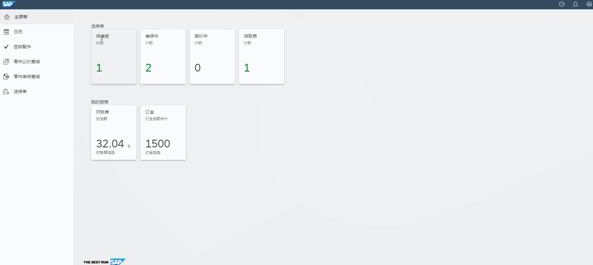
</p>

## 需要技术
* 掌握SAP Cloud for Customer业务角色配置
* 熟练PDI工具创建Customer Business Object(以下简称BO)及UI Design
* 熟练创建设计报表及绩效指标
* 掌握浏览器开发者工具调试

## 实现步骤

### 1.创建BO及UI,然后将视图分配给业务角色,再将自己使用的用户挂在此业务角色下,这里就直接跳过这一步,网上有很多C4C的技术文档

### 2.创建不带数量的卡片

* 以管理员角色登录到系统,编辑主屏幕,调整用户对应的角色
<p align="center">
  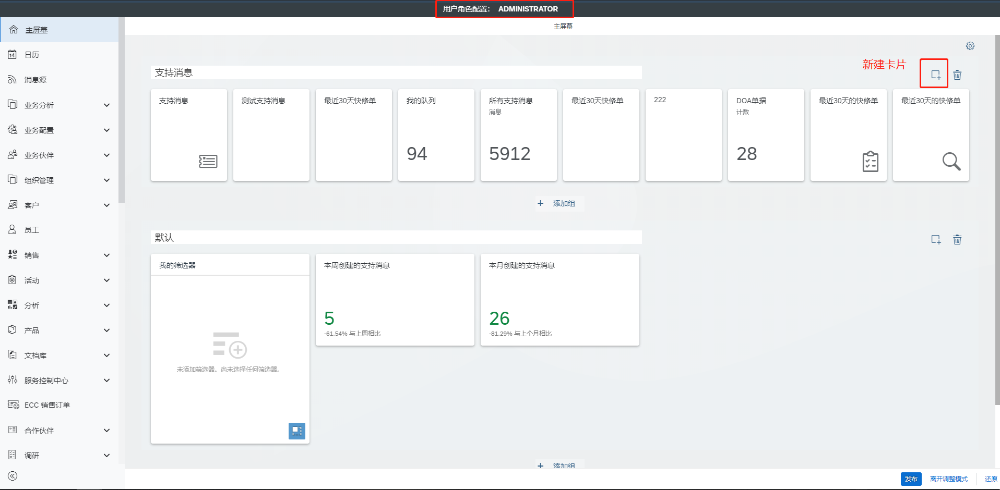
</p>

* 点击添加卡片按钮,选择创建自定义卡片
<br>
类型:窗体
<br>
标题:自定义
<br>
图标:任意
<br> 
描述:任意
<br>
路径:

```html
<WorkCenterPath>-<WorkCenterViewName>-<OWLName>::<Intort>::<DefaultSetName>
```
<p align="center">
  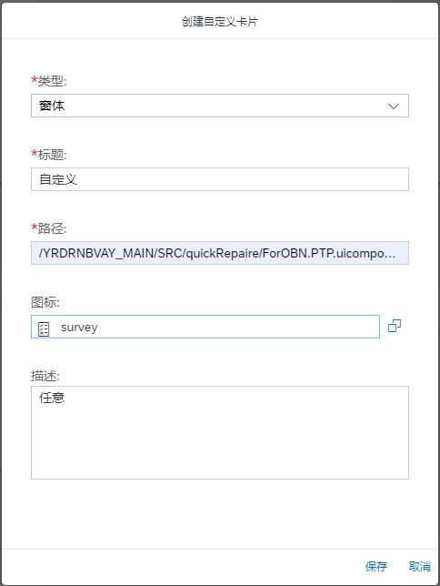
</p>

* 路径分析<br>

> &#60;WorkCenterPath&#62;<br>
WCF中的Unique ID<br>
我这里是：/YRDRNBVAY_MAIN/SRC/quickRepaire/QuickRepair_WCF.WCF.uiwoc
<p align="center">
  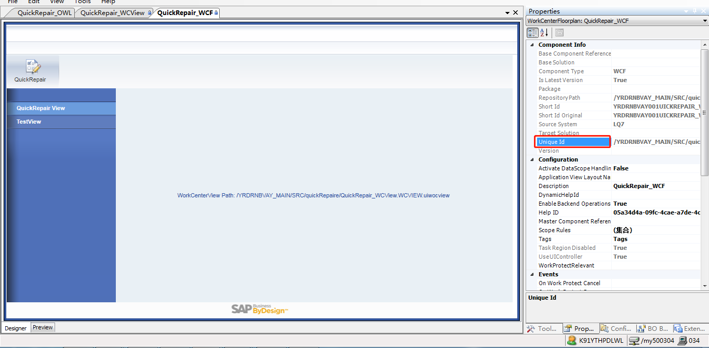
</p>

> &#60;WorkCenterViewName&#62;<br>
WCV中的name（标准bo是这样没错，但是自定义BO不是这样。先这样写，后面再修改）<br>
我这里是：QuickRepair_WCView
<p align="center">
  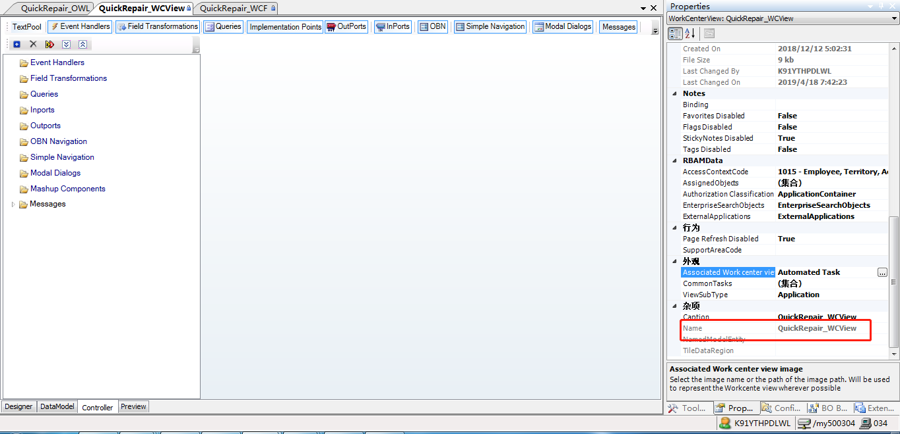
</p>

> &#60;OWLName&#62;<br>
OWL中的name<br>
我这里是：QuickRepair_OWL
<p align="center">
  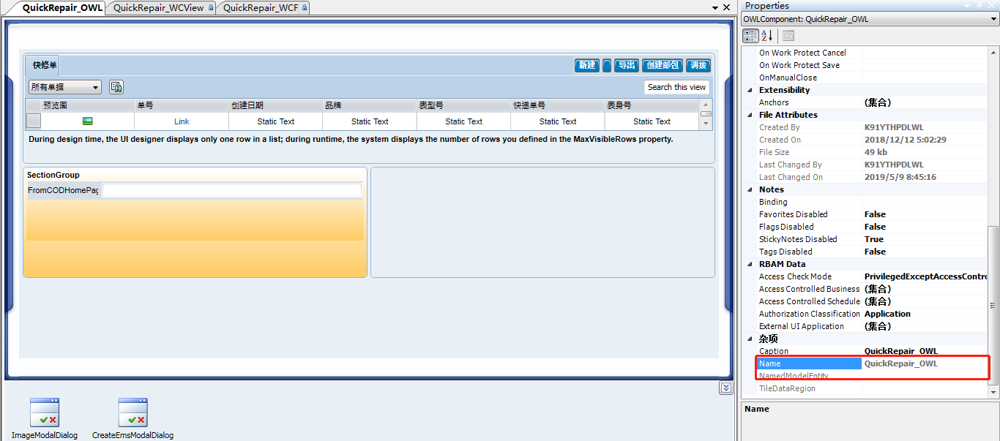
</p>

> &#60;Inport&#62;<br>
在OWL建个Inport
这里我用的名字是FromCODHomePage<br>
在root节点下新建个参数FromCODHomePage，名称随意，然后OWL defaultset绑定这个参数

<p align="center">
  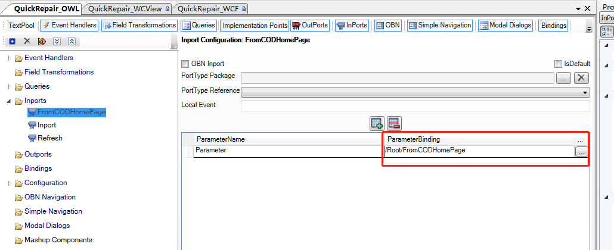
</p>
<p align="center">
  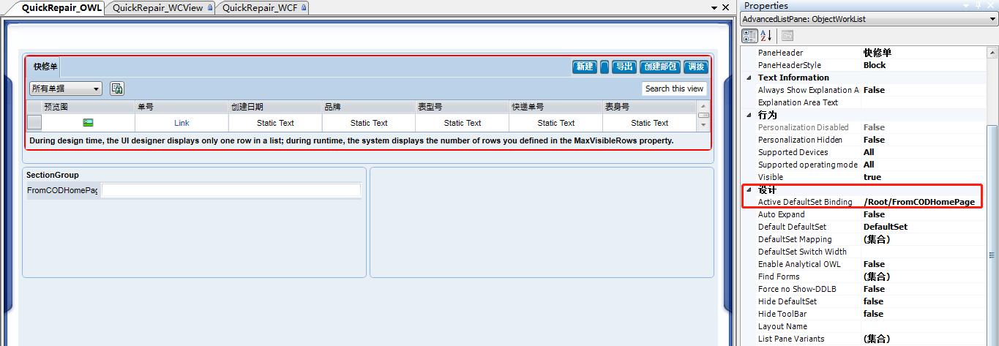
</p>

> &#60;DefaultSetName&#62;<br>
在OWL建个query,如果在query添加了Anchor,则用户也可以在前台保存自定义查询<br>
这种自定义的名称格式为"$PersonalizedDefaultSet*",这里不多讲,有兴趣可以联系我
<p align="center">
  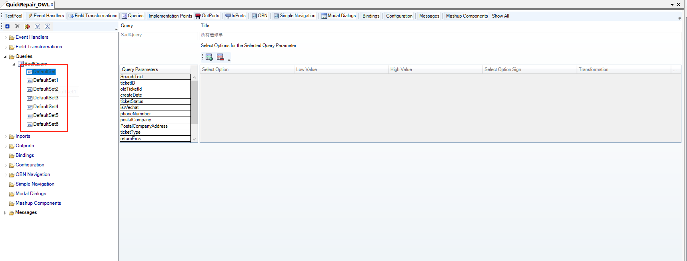
</p>

> 把以上所有的路径连接在一起<br>/YRDRNBVAY_MAIN/SRC/quickRepaire/QuickRepair_WCF.WCF.uiwoc-QuickRepair_WCView-QuickRepair_OWL::FromCODHomePage::DefaultSet

* 创建自定义卡片信息填写完整后,先不要点击保存<br>
>  Ctrl+shift+J打开开发者工具,搜索 _createNewTileCatalogObject,如果搜索不到,可以按F5刷新,重新搜索
<p align="center">
  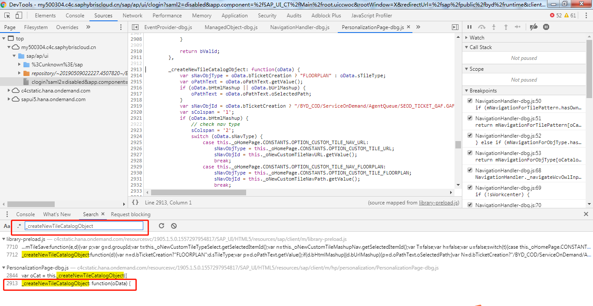
</p>

> 进入函数，找到下面位置打上断点
<p align="center">
  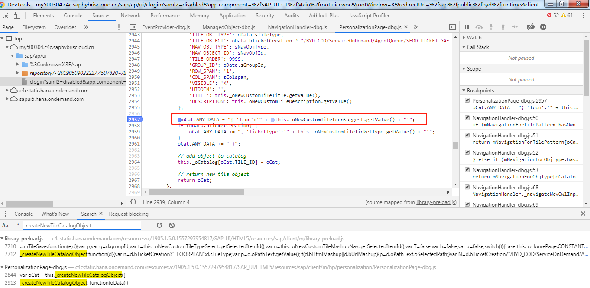
</p>

>回到前台，点击保存，进入到断点
<p align="center">
  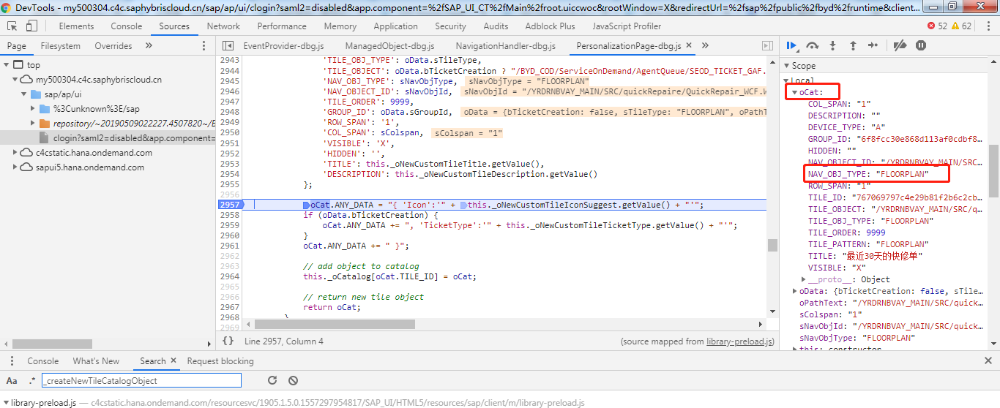
</p>

>把NAV_OBJ_TYPE 的 FLOORPLAN 改成OWL_INPORT
<p align="center">
  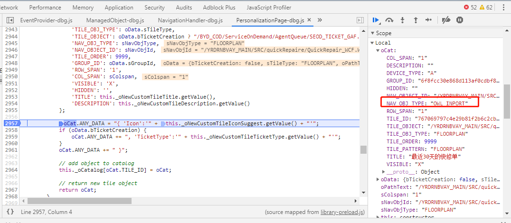
</p>

>F8执行,然后发布，离开调整模式
* 如果是标准BO(XBO),例如支持消息等,到这一步应该已经能正常打开,但自定义的BO会发现点击之后没有反应

> 打开开发者工具，搜索NavigationHandler._navigateWcvOwlInportQuery,对应位置打上断点
<p align="center">
  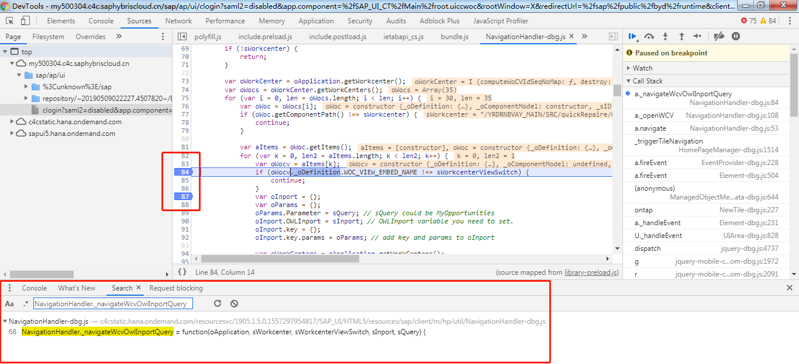
</p>

>点击刚才配置的卡片,会进入断点
<p align="center">
  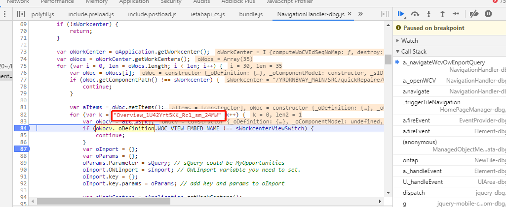
</p>

>在这里不难看出,是因为WCV_NAME的不匹配导致没有正确跳转,因为自定义BO的WCV视图名称是系统自动生成的一串代码，和我们在路径里面配置的匹配不上。这里我们把断点这里的值记下来，然后去调整自定义卡片的路径

>/YRDRNBVAY_MAIN/SRC/quickRepaire/QuickRepair_WCF.WCF.uiwoc-QuickRepair_WCView-QuickRepair_OWL::FromCODHomePage::DefaultSet<br>修改为<br>/YRDRNBVAY_MAIN/SRC/quickRepaireQuickRepair_WCF.WCFuiwoc-Overview_1U42Yrt5KK_Rcl_sm_24MW-QuickRepair_OWL::FromCODHomePage::DefaultSet<br>然后保存发布。离开调整模式,再次打开,成功跳转

* 至此,不带数量的卡片就已经完成了


